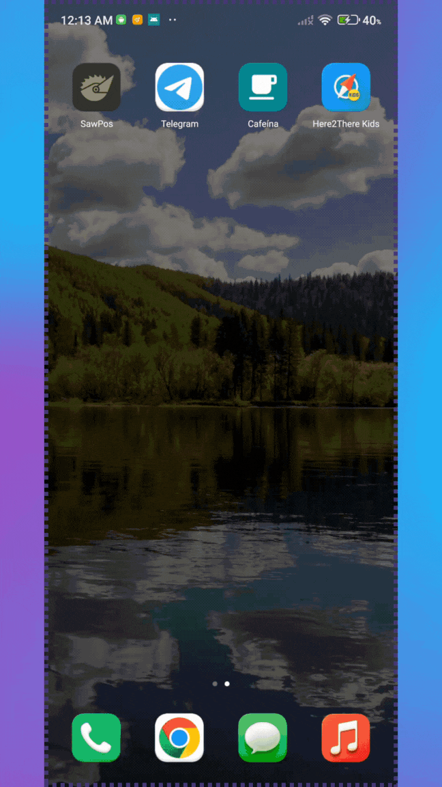

# 🚗 Here to There Kids

Una aplicación gratuita para ayudar a los niños a visualizar el progreso de un viaje, reduciendo la incertidumbre de "¿falta mucho para llegar?".

---

## 📖 Historia

Como padre, suelo buscar ideas creativas para motivar a mi hijo.  
Hace un tiempo vi a unos padres usando papel y cartón para mostrar el progreso de su viaje a su hijo, desde el punto de salida hasta el destino 🚗✨, evitándole la incertidumbre de no saber cuánto falta para llegar.  
Esto me inspiró a llevarlo al mundo digital.

Así nació esta aplicación gratuita 🎯  
No es perfecta, pero está abierta para que cualquiera pueda mejorarla y adaptarla.

---

## 📽 Demo
<details>
<summary>🛣️ Here 2 There Kids</summary>

 

---

</details>


## 🛠 Características
- Muestra el progreso del viaje en tiempo real.
- Interfaz visual amigable para niños.
- Configuración de punto de salida y destino.
- Código abierto y adaptable.

---

## 📦 Instalación

1. **Clonar el repositorio**
   ```bash
   git clone https://github.com/CapiFrank/here2there_kids.git
   cd here2there_kids

2. **Instalar dependencias**
    ```bash
    flutter pub get

3. **Ejecutar en un emulador o dispositivo**
    ```bash
    flutter run

## 📂 Estructura del proyecto
    
<details>
<summary>📦 here2there_kids</summary>

```bash
    ├── 📂 assets
    │   ├── 🌿 bush_1.png 🌿 bush_2.png 🌿 bush_3.png
    │   ├── 🌿 bush_4.png 🌿 bush_5.png 🌿 bush_6.png
    │   ├── 🌿 bush_7.png 🌿 bush_8.png 🌿 bush_9.png
    │   ├── 🏰 castle.png ☁️ cloud_1.png ☁️ cloud_2.png
    │   ├── ☁️ cloud_3.png ☁️ cloud_4.png 🎞️ demo.gif
    │   ├── 🌱 grass.png 🏠 house.png 🏞️ landscape.png
    │   ├── 🛣️ road.png 🛣️ road_2.png 🌌 sky.png
    │   ├── ⭐ star_1.png ⭐ star_2.png ⭐ star_3.png
    │   ├── ⭐ star_4.png ⭐ star_5.png ⭐ star_6.png
    │   ├── ☀️ sun.png 🌳 tree_1.png 🌳 tree_2.png
    │   └── 🌳 tree_3.png 🚗 vehicle.png
    │
    ├── 📂 lib
    │   ├── 📄 main.dart
    │   │
    │   ├── 📂 components
    │   │   ├── 🔍 search_input_bar.dart
    │   │   ├── 🔍 search_overlay.dart
    │   │   ├── 💬 search_suggestions_dialog.dart
    │   │   └── 🎨 sprite.dart
    │   │
    │   ├── 📂 screens
    │   │   ├── 📂 map
    │   │   │   ├── 🗺️ map_screen.dart
    │   │   │   └── 📂 widgets
    │   │   │       ├── 📍 destination_marker.dart
    │   │   │       ├── 📍 location_fab.dart
    │   │   │       ├── 🗺️ map_view.dart
    │   │   │       ├── 🧭 north_fab.dart
    │   │   │       └── ℹ️ place_info_modal.dart
    │   │   │
    │   │   └── 📂 travel
    │   │       ├── ✈️ travel_screen.dart
    │   │       └── 📂 widgets
    │   │           └── 🎉 arrival_celebration.dart
    │   │
    │   ├── 📂 services
    │   │   └── 📡 location_progress_service.dart
    │   │
    │   ├── 📂 sprites
    │   │   ├── 🌿 bush_1.dart 🌿 bush_2.dart 🌿 bush_3.dart
    │   │   ├── 🌿 bush_4.dart 🌿 bush_5.dart 🌿 bush_6.dart
    │   │   ├── 🌿 bush_7.dart 🌿 bush_8.dart 🌿 bush_9.dart
    │   │   ├── 🏰 castle.dart ☁️ cloud_1.dart ☁️ cloud_2.dart
    │   │   ├── ☁️ cloud_3.dart ☁️ cloud_4.dart 🌱 grass.dart
    │   │   ├── 🏠 house.dart 🛣️ road.dart 🌌 sky.dart
    │   │   ├── ⭐ star_1.dart ⭐ star_2.dart ⭐ star_3.dart
    │   │   ├── ⭐ star_4.dart ⭐ star_5.dart ⭐ star_6.dart
    │   │   ├── ☀️ sun.dart 🌳 tree_1.dart 🌳 tree_2.dart
    │   │   └── 🌳 tree_3.dart
    │   │
    │   └── 📂 utils
    │       ├── ⚠️ error_handler.dart
    │       ├── 💬 message_handler.dart
    │       └── 📍 nearby_searcher.dart
```
</details> 


## 🤝 Contribuciones

¡Las contribuciones son bienvenidas!
Puedes abrir un issue para sugerir mejoras o enviar un pull request con tus cambios.

##
💛 Ojalá esta app sirva a más familias en sus viajes.